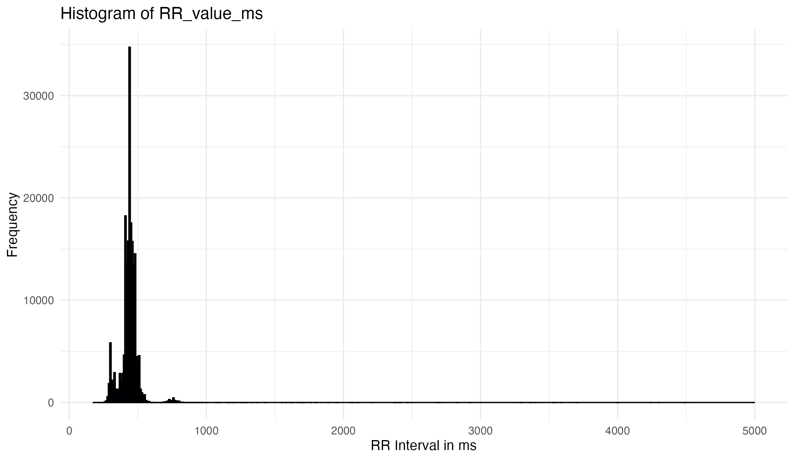
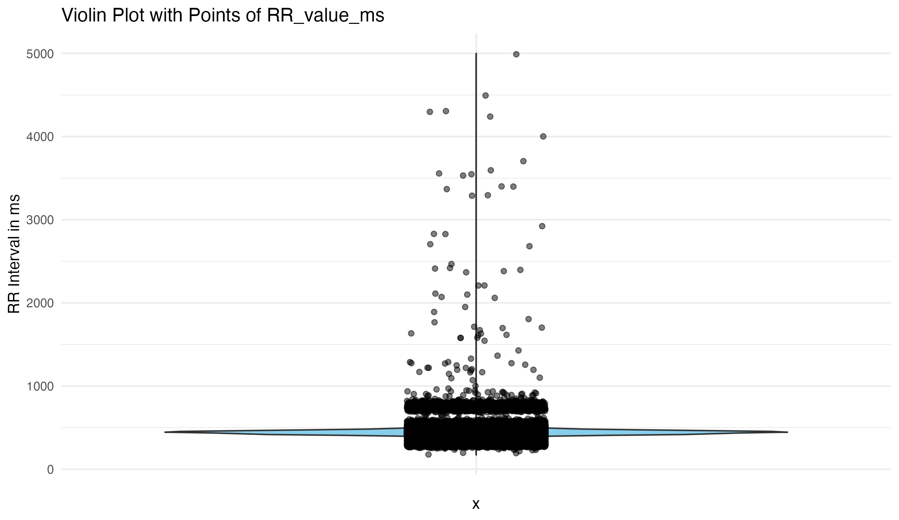

ECG
================
2024-02-16

<!-- -->

## Introduction

### ECG data processing

Example from
**./ecg_process/ecg_process.R**:

**Raw data is very noise and has big outliers (large RR intervals).**
<div style="display: flex; justify-content: space-between;">
  
  
</div>

**Use cleaning and clustering to detect the outliers**
<div style="display: flex; justify-content: space-between;">
  
  
</div>

### ECG waveform simulation and analysis

This set of examples focuses on the simulation and analysis of
Electrocardiogram (ECG) waveforms to study Heart Rate Variability (HRV)
in a controlled, simulated environment. Using custom R functions for ECG
waveform generation, we explore the effects of different conditions
(control vs. case groups) on HRV, incorporating covariates such as age,
sex, and treatment types in our analysis. The goal is to illustrate the
application of statistical or machine learning methods, including
Generalized Linear Models (GLM), to understand the potential influences
on heart rate signals.

### Features

- **ECG Simulation**: Utilizing logistic map-based simulations to
  generate synthetic ECG waveforms, mimicking real heart rate
  variability patterns.
- **Peak Detection**: Implementing basic algorithms to identify R peaks
  within the ECG waveforms, a critical step for HRV analysis.
- **Covariate Integration**: Including simulated demographic and
  treatment data to examine the broader impacts on HRV.
- **Statistical Analysis**: Applying t-tests for initial comparisons and
  GLMs to account for multiple covariates, aiming to uncover any
  significant differences in HRV between groups.
- **Visualization**: `ggplot2` for visualization of ECG data, analysis
  results, and the effects of covariates.

Load custom ECG simulation functions

``` r
source("./ecg_functions.R")
library(ggplot2)
library(dplyr)
```

## Illustration of ECG wave

### Prepare dataset

- Initial setup for ECG waveform simulation.
- Define the total number of heartbeats and other parameters for ECG
  simulation.

``` r
T <- 3  # Total heart beats
P1 <- 0.5  # Starting value for the logistic map
r <- 3.0  # Logistic map parameter
cons <- 0.0  # Constant added to logistic map output
SAMPLING_RATE <- 125  # Sampling rate for the ECG in Hz
```

- Simulate ECG data
- Generate P vector using logistic map

``` r
P <- numeric(T)
P[1] <- P1
for (i in 2:T) {
  P[i] <- r * P[i - 1] * (1 - P[i - 1])
}
P <- P + cons
```

- Convert P vector to Q vector and simulate ECG waveform

``` r
Q <- cumsum(P)
ecg <- fit_ecg_waves_to_beats(Q, sampling_rate=SAMPLING_RATE)
t <- seq_along(ecg) / SAMPLING_RATE
```

- Plot simulated ECG waveform

``` r
ecg_data <- data.frame(Time = t, ECG = ecg)
head(ecg_data)
```

    ##    Time         ECG
    ## 1 0.008  0.81412525
    ## 2 0.016  0.66425004
    ## 3 0.024  0.50441533
    ## 4 0.032  0.34482331
    ## 5 0.040  0.08031695
    ## 6 0.048 -0.20324786

### Peak detection

- Step 1: Detect peaks - Find local maxima
- A simple approach to find local maxima (peaks)

``` r
find_peaks <- function(ecg_data) {
  peaks <- which(diff(sign(diff(ecg_data$ECG))) == -2) + 1
  peak_data <- ecg_data[peaks, ]
  return(peak_data)
}

peak_data <- find_peaks(ecg_data)
```

- Step 2: Filter peaks by separation - ensure they are at least 0.4s
  apart (assumption)
- Sort peaks by amplitude to get the highest peaks first

``` r
sorted_peaks <- peak_data[order(-peak_data$ECG), ]
filtered_peaks <- sorted_peaks[1, ]  # Initialize with the highest peak

for (i in 2:nrow(sorted_peaks)) {
  if (all(abs(filtered_peaks$Time - sorted_peaks$Time[i]) >= 0.4)) {
    filtered_peaks <- rbind(filtered_peaks, sorted_peaks[i, ])
    if (nrow(filtered_peaks) == 2) break  # Stop after finding the second peak
  }
}
```

- Step 3: Plot and annotate the ECG waveform with R peaks

``` r
p <- ggplot(ecg_data, aes(x = Time, y = ECG)) +
  geom_line() +
  geom_point(data = filtered_peaks, aes(x = Time, y = ECG), color = "red", size = 3) +
  geom_text(data = filtered_peaks, aes(x = Time, y = ECG, label = "R"), vjust = -2, color = "red") +
  labs(title = "Simulated ECG Waveform with R Peak detection", x = "Time (s)", y = "Amplitude (mV)") +
  theme_minimal()

# print(p)

# Calculate the time difference between the two peaks
if (nrow(filtered_peaks) >= 2) {
  time_diff <- diff(filtered_peaks$Time)
  time_diff_label <- paste(round(time_diff, 2), "s")

  # Coordinates for annotation placement
  x_midpoint <- sum(filtered_peaks$Time) / 2
  y_max <- max(ecg_data$ECG) * 1.1

  # Add a line connecting the two peaks and annotate it with the time difference
  p <- p + geom_segment(aes(x = filtered_peaks$Time[1], y = max(ECG),
                            xend = filtered_peaks$Time[2], yend = max(ECG)),
                        linetype = "dashed", color = "blue") +
    annotate("text", x = x_midpoint, y = y_max, label = time_diff_label, color = "blue")
}

print(p)
```

<!-- -->

## Example of full dataset

- Initial setup for ECG waveform simulation

``` r
# Define the total number of heartbeats and other parameters for ECG simulation

T <- 20  # Total heart beats
P1 <- 0.5  # Starting value for the logistic map
r <- 3.0  # Logistic map parameter
cons <- 0.0  # Constant added to logistic map output
SAMPLING_RATE <- 125  # Sampling rate for the ECG in Hz
```

- Simulate ECG data.
- Generate P vector using logistic map.

``` r
P <- numeric(T)
P[1] <- P1
for (i in 2:T) {
  P[i] <- r * P[i - 1] * (1 - P[i - 1])
}
P <- P + cons
```

- Convert P vector to Q vector and simulate ECG waveform

``` r
Q <- cumsum(P)
ecg <- fit_ecg_waves_to_beats(Q, sampling_rate=SAMPLING_RATE)
t <- seq_along(ecg) / SAMPLING_RATE
```

- Plot simulated ECG waveform

``` r
ecg_data <- data.frame(Time = t, ECG = ecg)

ggplot(ecg_data, aes(x = Time, y = ECG)) +
  geom_line() +
  labs(title = "Simulated ECG Waveform", x = "Time (s)", y = "Amplitude (mV)") +
  theme_minimal()
```

<!-- -->

## Simulate HRV data for case/control study

- Simulate RR intervals with variability for two groups: control and
  case

``` r
N <- 100  # Number of RR intervals per group
control_rr <- simulate_rr_intervals_group(N, 0.8, 0.05, "Control")
case_rr <- simulate_rr_intervals_group(N, 0.8, 0.15, "Case")
hrv_data <- rbind(control_rr, case_rr)
```

- Summarize HRV metrics for each group

``` r
hrv_summary <- hrv_data |>
  group_by(Group) |>
  summarise(Mean_RR = mean(RR_Interval),
            SDNN = sd(RR_Interval),
            RMSSD = sqrt(mean(diff(RR_Interval)^2)))

head(hrv_summary)
```

    ## # A tibble: 2 × 4
    ##   Group   Mean_RR   SDNN  RMSSD
    ##   <chr>     <dbl>  <dbl>  <dbl>
    ## 1 Case      0.808 0.0901 0.135 
    ## 2 Control   0.800 0.0306 0.0423

- Plot HRV data showing RR interval variability between groups

``` r
ggplot(hrv_data, aes(x = Group, y = RR_Interval)) +
  geom_boxplot() +
  geom_jitter(alpha = 0.5, width = 0.3, height = 0) +
  labs(title = "RR Interval Variability by Group", x = "Group", y = "RR Interval (s)") +
  theme_minimal()
```

<!-- -->

- Assess distribution of RR intervals for normality

``` r
# Plot histograms and Q-Q plots for visual inspection
ggplot(hrv_data, aes(x = RR_Interval, fill = Group)) +
  geom_histogram(bins = 30, alpha = 0.6) +
  facet_wrap(~Group) +
  labs(title = "Distribution of RR Intervals by Group", x = "RR Interval (s)", y = "Count") +
  theme_minimal()
```

<!-- -->

``` r
# Q-Q plots for Control and Case groups using ggplot2
ggplot(hrv_data, aes(sample = RR_Interval)) +
  stat_qq() +
  stat_qq_line() +
  ggtitle("Q-Q Plot for Control Group") +
  theme_minimal() +
  facet_grid(.~Group, scales="free")
```

<!-- -->

- Perform Shapiro-Wilk test for normality

``` r
shapiro_test_control <- shapiro.test(hrv_data$RR_Interval[hrv_data$Group == "Control"])
shapiro_test_case <- shapiro.test(hrv_data$RR_Interval[hrv_data$Group == "Case"])
print(shapiro_test_control)
```

    ## 
    ##  Shapiro-Wilk normality test
    ## 
    ## data:  hrv_data$RR_Interval[hrv_data$Group == "Control"]
    ## W = 0.94082, p-value = 0.0002163

``` r
print(shapiro_test_case)
```

    ## 
    ##  Shapiro-Wilk normality test
    ## 
    ## data:  hrv_data$RR_Interval[hrv_data$Group == "Case"]
    ## W = 0.93559, p-value = 0.0001048

- Decision on statistical test based on normality assessment
- If normality is not rejected, use t-test; otherwise, consider
  Mann-Whitney U test.
- Example of performing a t-test (replace with Mann-Whitney U test if
  necessary)

``` r
t_test_result <- t.test(RR_Interval ~ Group, data=hrv_data)
print(t_test_result)
```

    ## 
    ##  Welch Two Sample t-test
    ## 
    ## data:  RR_Interval by Group
    ## t = 0.8715, df = 121.53, p-value = 0.3852
    ## alternative hypothesis: true difference in means between group Case and group Control is not equal to 0
    ## 95 percent confidence interval:
    ##  -0.01055037  0.02714454
    ## sample estimates:
    ##    mean in group Case mean in group Control 
    ##             0.8084336             0.8001365

## Generalised linear model (GLM)

In this section of our analysis, we employ a Generalized Linear Model
(GLM) as a more sophisticated approach to analyzing our data, as opposed
to relying solely on a t-test. The example of GLM framework is chosen
for several reasons:

1.  **Incorporation of Multiple Covariates**: Unlike the t-test, which
    is limited to comparing means between two groups, GLM allows us to
    account for the influence of multiple covariates simultaneously.
    This is crucial in our study, as we’re interested in understanding
    how factors such as age (`Age_day`), sex (`Sex`), and treatment type
    (`Treatment`) might impact Heart Rate Variability (HRV), alongside
    the primary variable of interest (Group).

2.  **Flexibility in Modeling Different Types of Data**: GLM extends the
    general linear model to allow for response variables that have error
    distribution models other than a normal distribution. This makes it
    suitable for a wide range of data types and link functions,
    providing a more accurate analysis that aligns with the underlying
    data distribution.

3.  **Ability to Handle Non-linear Relationships**: Through the use of
    link functions, GLMs can model relationships between the predictor
    and response variables that are not necessarily linear. This
    capability is particularly important in biomedical data, where many
    relationships are complex and non-linear.

4.  **Direct Estimation of Effect Size and Significance**: GLMs provide
    direct estimates of the effect size for each covariate, including
    confidence intervals and p-values, making it easier to interpret the
    impact of each factor on the response variable. This comprehensive
    insight is invaluable in discerning not just if there is an effect,
    but how strong that effect is, and how confidently we can assert its
    presence.

5.  **Improved Precision and Power**: By adjusting for additional
    covariates that might influence the response variable, GLMs can
    reduce unexplained variability in the data. This leads to more
    precise estimates of the effects of interest and potentially
    increases the statistical power of the analysis.

By leveraging a GLM, we’re not just comparing group means; we’re
constructing a more nuanced understanding of how various factors
contribute to differences in RR intervals, providing a deeper insight
into the dynamics of heart rate variability. This approach allows us to
make more informed conclusions about the data, supported by a robust
statistical framework that accounts for the multifaceted nature of
biological phenomena.

## Covariate data

- Simulating covariate data

``` r
set.seed(123)  # For reproducibility

covariate_data <- data.frame(
  Sample = 1:(2*N),  # Assuming N samples per group as before
  Age_day = sample(0:60, 2*N, replace = TRUE),
  Sex = sample(0:1, 2*N, replace = TRUE),
  Treatment = sample(c("a", "b", "c"), 2*N, replace = TRUE)
)

# Combine with HRV data
hrv_data <- cbind(hrv_data, covariate_data)
head(hrv_data)
```

    ##   RR_Interval   Group Sample Age_day Sex Treatment
    ## 1   0.7742978 Control      1      30   1         b
    ## 2   0.7938344 Control      2      14   1         a
    ## 3   0.8480075 Control      3      50   1         b
    ## 4   0.7611492 Control      4      13   0         b
    ## 5   0.7843837 Control      5       2   0         b
    ## 6   0.7632358 Control      6      41   1         a

``` r
# Convert necessary factors
hrv_data$Group <- as.factor(hrv_data$Group)
hrv_data$Sex <- as.factor(hrv_data$Sex)
hrv_data$Treatment <- as.factor(hrv_data$Treatment)
```

- Fit GLM model

``` r
glm_model <- glm(RR_Interval ~ Group + Age_day + Sex + Treatment, data = hrv_data, family = gaussian())

# Summary of GLM results
summary(glm_model)
```

    ## 
    ## Call:
    ## glm(formula = RR_Interval ~ Group + Age_day + Sex + Treatment, 
    ##     family = gaussian(), data = hrv_data)
    ## 
    ## Deviance Residuals: 
    ##       Min         1Q     Median         3Q        Max  
    ## -0.156667  -0.035937   0.006798   0.039084   0.147207  
    ## 
    ## Coefficients:
    ##                Estimate Std. Error t value Pr(>|t|)    
    ## (Intercept)   0.7999151  0.0142399  56.174   <2e-16 ***
    ## GroupControl -0.0086322  0.0096890  -0.891    0.374    
    ## Age_day       0.0004314  0.0002968   1.453    0.148    
    ## Sex1         -0.0077469  0.0097240  -0.797    0.427    
    ## Treatmentb    0.0047564  0.0121710   0.391    0.696    
    ## Treatmentc   -0.0065654  0.0122398  -0.536    0.592    
    ## ---
    ## Signif. codes:  0 '***' 0.001 '**' 0.01 '*' 0.05 '.' 0.1 ' ' 1
    ## 
    ## (Dispersion parameter for gaussian family taken to be 0.004542105)
    ## 
    ##     Null deviance: 0.90077  on 199  degrees of freedom
    ## Residual deviance: 0.88117  on 194  degrees of freedom
    ## AIC: -503.39
    ## 
    ## Number of Fisher Scoring iterations: 2

- Predicted vs. Actual RR Intervals Plot
- This plot shows the relationship between the actual RR intervals and
  the predicted RR intervals from the GLM, providing insight into the
  model’s accuracy.

``` r
# Calculate predicted values
hrv_data$Predicted_RR <- predict(glm_model, type = "response")

# Plot of Actual vs. Predicted RR Intervals
ggplot(hrv_data, aes(x = Predicted_RR, y = RR_Interval)) +
  geom_point(aes(color = Group), alpha = 0.6) +
  geom_abline(intercept = 0, slope = 1, linetype = "dashed", color = "red") +
  labs(title = "Actual vs. Predicted RR Intervals", x = "Predicted RR Interval (s)", y = "Actual RR Interval (s)") +
  theme_minimal()
```

<!-- -->

- Residuals Plot
- This plot examines the residuals (differences between actual and
  predicted values) to check for any systematic patterns that might
  suggest inadequacies in the model.

``` r
# Calculate residuals
hrv_data$Residuals <- residuals(glm_model)

# Residuals Plot
ggplot(hrv_data, aes(x = Predicted_RR, y = Residuals)) +
  geom_hline(yintercept = 0, linetype = "dashed", color = "red") +
  geom_point(aes(color = Group), alpha = 0.6) +
  labs(title = "Residuals vs. Predicted RR Intervals", x = "Predicted RR Interval (s)", y = "Residuals") +
  theme_minimal()
```

<!-- -->

- Effect Plot for a Single Covariate
- To illustrate the effect of a single covariate while holding others
  constant, you can create a plot for one covariate at a time. Here’s an
  example for Age:

``` r
# Assuming 'Age' is a continuous variable in your model
ggplot(hrv_data, aes(x = Age_day, y = RR_Interval)) +
  geom_point(aes(color = Group), alpha = 0.6) +
  geom_smooth(method = "glm", method.args = list(family = "gaussian"), formula = y ~ x, aes(group = Group, color = Group)) +
  labs(title = "Effect of Age on RR Interval", x = "Age (days)", y = "RR Interval (s)") +
  theme_minimal()
```

<!-- -->

- Visualize effects of Group and Covariates on RR Interval

``` r
ggplot(hrv_data, aes(x = Group, y = RR_Interval, color = Group)) +
  geom_boxplot() +
  geom_point() +
  facet_wrap(~Sex + Treatment, scales = "free_x") +
  labs(title = "RR Interval Variability by Group with Covariates\n(sex 0/1, treatments a,b,c)", x = "Group", y = "RR Interval (s)") +
  theme_minimal()
```

<!-- -->

## Waveform notes

### ECG simulation functions overview

The `ecg_functions.R` file includes custom functions designed for
simulating Electrocardiogram (ECG) waveforms and analyzing Heart Rate
Variability (HRV). These functions are used to generate synthetic ECG
data, detect R peaks, simulate variability in RR intervals, and prepare
data for case/control studies. The original inspiration for these
functions came from the `ecg_wave` function from [Tanzir Hasan’s ECG
Simulation project](https://github.com/tanzirhasan/ECG_Simulation).

## Main Distribution Functions

The ECG waveform simulation leverages several key functions:

- **`ecg_wave`**: Generates individual ECG wave components (P, Q, R, S,
  T waves) based on Fourier series expansions. Each wave represents
  different phases of the heart’s electrical activity.

- **`fit_ecg_waves_to_beats`**: Combines the individual wave functions
  into a complete ECG waveform over a series of heartbeats, adjusted for
  heart rate variability.

## Variability Functions

To analyze HRV, we introduce variability in the simulated RR intervals:

- **`simulate_rr_intervals`**: Simulates RR intervals with specified
  baseline and variability, representing the time between successive R
  peaks.

- **`rr_intervals_to_beats`**: Converts RR intervals into cumulative
  beats for further simulation, facilitating HRV analysis.

## Simulating Groups

For our case/control study, we simulate groups with different HRV
characteristics:

- **`simulate_rr_intervals_group`**: Generates RR intervals for a
  specified group, incorporating baseline RR intervals and variability,
  useful for simulating control and case groups in our analysis.

### README

Finally, automatically convert this document to the GitHub project level
README.

``` r
file.copy("ecg_vcurrent.md", "README.md", overwrite = TRUE)
```

    ## [1] TRUE
